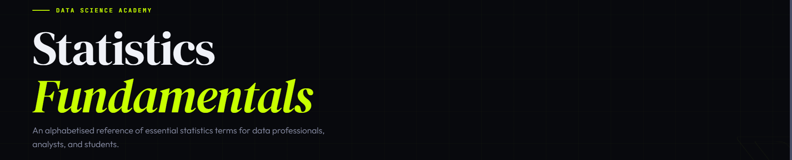
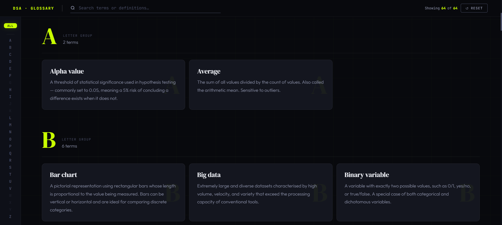

# 📊 واژه‌نامه مبانی آمار


<p align="center">
  
  
  
  
  
</p>

<p align="center">
  
  
  
  
</p>

---

## نمای کلی

این واژه‌نامه تعاملی، مجموعه‌ای جامع از اصطلاحات آماری را به همراه قابلیت جستجوی بی‌درنگ ارائه می‌دهد. این ابزار با استفاده از HTML، CSS و جاوااسکریپت خالص ساخته شده و روشی شهودی برای کاوش مفاهیم آماری فراهم می‌کند.

---

## ✨ ویژگی‌های کلیدی

### 🔍 جستجوی هوشمند و ناوبری

| ویژگی                          | توضیح                                                                             |
| ------------------------------ | --------------------------------------------------------------------------------- |
| **جستجوی بی‌درنگ**      | با هر بار تایپ، واژه‌ها در لحظه فیلتر می‌شوند                                    |
| **ناوبری حروف الفبا**   | با کلیک روی هر حرف، به بخش مربوطه بروید                                          |
| **نمایش همه واژه‌ها**   | کل واژه‌نامه را به‌صورت یکجا مرور کنید                                           |
| **برجسته‌سازی جستجو**  | عبارت‌های جستجو‌شده با رنگ لیمویی برجسته می‌شوند                                |
| **شمارنده زنده**       | تعداد واژه‌های فیلتر شده نسبت به کل واژه‌ها را نشان می‌دهد                       |
| **میانبرهای صفحه‌کلید** | `Ctrl+F` برای فوکوس روی جستجو و `Escape` برای پاک‌سازی فیلتر                     |

### 📚 بیش از ۶۴ واژه جامع

| دسته‌بندی                       | تعداد | مثال‌ها                                                               |
| ------------------------------- | ----- | --------------------------------------------------------------------- |
| **آمار پایه**            | ۱۵+   | میانگین، میانه، نما، انحراف معیار                                     |
| **احتمال**               | ۸+    | احتمال، مقدار P، توزیع نرمال                                          |
| **رگرسیون**              | ۱۲+   | رگرسیون خطی، R-squared، هم‌خطی چندگانه                                |
| **آزمون فرضیه**          | ۶+    | فرضیه، فرضیه صفر، مقدار آلفا                                          |
| **تصویرسازی داده**       | ۸+    | هیستوگرام، جعبه‌ای، پراکندگی                                          |
| **موضوعات پیشرفته**      | ۵+    | درون‌زایی، VIF، بیش‌برازش                                             |



---

## 📖 فهرست کامل واژه‌ها

### الف

| واژه                     | تعریف                                                                                                                                                                                                   |
| ------------------------ | ------------------------------------------------------------------------------------------------------------------------------------------------------------------------------------------------------- |
| **مقدار آلفا**     | آستانه‌ای برای معنی‌داری آماری در آزمون فرضیه — معمولاً ۰٫۰۵ که یعنی ۵٪ ریسک نتیجه‌گیری اشتباه در مورد وجود تفاوت.                                                                                     |
| **میانگین**         | مجموع همه مقادیر تقسیم بر تعداد آنها. به آن میانگین حسابی نیز می‌گویند. به داده‌های پرت حساس است.                                                                                                     |

### ب

| واژه                        | تعریف                                                                                                                                                                                                                           |
| --------------------------- | ------------------------------------------------------------------------------------------------------------------------------------------------------------------------------------------------------------------------------- |
| **نمودار ستونی**      | نمایش تصویری با میله‌های مستطیلی که طول هر میله متناسب با مقدار مورد نظر است. برای مقایسه دسته‌های گسسته مناسب است.                                                                                                            |
| **داده‌های کلان**     | مجموعه‌های بسیار بزرگ و متنوع که با حجم، سرعت و تنوع بالا، از ظرفیت ابزارهای معمولی فراتر می‌روند.                                                                                                                              |
| **متغیر دودویی**      | متغیری که دقیقاً دو مقدار ممکن دارد؛ مانند ۰/۱، بله/خیر یا درست/نادرست. حالت خاصی از متغیر طبقه‌ای.                                                                                                                              |
| **نمودار جعبه‌ای**    | خلاصه‌ای گرافیکی شامل میانه، چارک‌ها و نقاط پرت. جعبه محدوده بین چارکی را نشان می‌دهد و سبیل‌ها تا نقاط غیرپرتی ادامه دارند.                                                                                                    |
| **نمودار حبابی**      | نمودار پراکندگی با یک متغیر سوم که به‌عنوان اندازه هر دایره کدگذاری می‌شود و امکان نمایش روابط سه‌بعدی را در دو بعد فراهم می‌کند.                                                                                               |
| **تحلیل‌گر کسب‌وکار** | متخصص داده‌ای که بین اهداف کسب‌وکار و راه‌حل‌های فنی پل می‌زند؛ نیازمندی‌ها را جمع‌آوری و امکان‌سنجی انجام می‌دهد.                                                                                                             |

### پ

| واژه                         | تعریف                                                                                                                                                                                                                             |
| ---------------------------- | --------------------------------------------------------------------------------------------------------------------------------------------------------------------------------------------------------------------------------- |
| **متغیر طبقه‌ای**      | متغیری که هر مشاهده را بر اساس یک ویژگی کیفی به یک گروه نام‌دار نسبت می‌دهد. شامل اسمی (بدون ترتیب) و ترتیبی (با ترتیب) است.                                                                                                     |
| **نمودار شمارشی**      | نموداری که تعداد وقوع هر دسته را در یک متغیر طبقه‌ای نشان می‌دهد و توزیع فراوانی داده‌های کیفی را نمایش می‌دهد.                                                                                                                  |
| **داده‌های مقطعی**     | مشاهداتی که از چندین سوژه در یک نقطه زمانی مشخص جمع‌آوری شده‌اند. در مقابل داده‌های سری زمانی قرار دارد.                                                                                                                         |
| **تابع توزیع تجمعی**   | تابع F(x) که احتمال اینکه متغیر تصادفی X مقداری ≤ x بگیرد را نشان می‌دهد. از ۰ تا ۱ افزایش می‌یابد و توزیع را کامل توصیف می‌کند.                                                                                                 |

### ت

| واژه                          | تعریف                                                                                                                                                                                                                           |
| ----------------------------- | ------------------------------------------------------------------------------------------------------------------------------------------------------------------------------------------------------------------------------- |
| **علم داده**            | حوزه‌ای میان‌رشته‌ای که آمار، علوم کامپیوتر و تخصص حوزه را ترکیب می‌کند تا بینش‌های معنادار و مدل‌های پیش‌بینی‌کننده از داده استخراج کند.                                                                                     |
| **روش دلفی**            | روش ساخت‌یافته پیش‌بینی که نظرات خبرگان را در چند دور ناشناس جمع‌آوری و اصلاح می‌کند تا به اجماع برسد.                                                                                                                         |
| **متغیر وابسته**        | متغیر پیامد در مطالعه که ممکن است در پاسخ به تغییر متغیر مستقل تغییر کند. معمولاً با Y در مدل‌های رگرسیون نشان داده می‌شود.                                                                                                    |
| **آمار توصیفی**         | روش‌هایی برای خلاصه‌سازی و توصیف داده‌ها از طریق معیارهای عددی (میانگین، واریانس) یا نمایش‌های بصری (هیستوگرام، جعبه‌ای) بدون استنباط درباره جمعیت.                                                                            |
| **متغیر دوگانه**        | متغیری که دقیقاً دو مقدار متقابل دارد، مانند قبول/رد یا زنده/مرده.                                                                                                                                                               |
| **پراکندگی**            | میزان گستردگی مقادیر داده حول یک مرکز. معیارهای رایج شامل دامنه، واریانس، انحراف معیار و دامنه بین‌چارکی است.                                                                                                                   |

### ث

| واژه                 | تعریف                                                                                                                                                                                                   |
| -------------------- | ------------------------------------------------------------------------------------------------------------------------------------------------------------------------------------------------------- |
| **درون‌زایی**  | مشکل در رگرسیون که در آن یک متغیر مستقل با جمله خطا همبسته است و منجر به برآوردهای اریب و ناپایدار ضرایب می‌شود.                                                                                       |

### ج

| واژه                 | تعریف                                                                                                                                                                                                   |
| -------------------- | ------------------------------------------------------------------------------------------------------------------------------------------------------------------------------------------------------- |
| **آماره F**    | نسبت دو واریانس که در تحلیل واریانس و آزمون‌های F رگرسیون برای بررسی تفاوت میانگین گروه‌ها یا معنی‌داری کلی مدل استفاده می‌شود.                                                                       |

### ح

| واژه                        | تعریف                                                                                                                                                                                                                           |
| --------------------------- | ------------------------------------------------------------------------------------------------------------------------------------------------------------------------------------------------------------------------------- |
| **هیستوگرام**         | نمودار ستونی برای داده‌های پیوسته که مقادیر در بازه‌های هم‌عرض گروه‌بندی می‌شوند. ارتفاع ستون بیانگر فراوانی یا چگالی و شکل توزیع را نشان می‌دهد.                                                                              |
| **هم‌واریانس ثابت**   | فرضی در رگرسیون که واریانس باقیمانده‌ها در همه سطوح متغیر پیش‌بین ثابت است. نقض آن ناهم‌واریانس نامیده می‌شود.                                                                                                                  |
| **فرضیه**             | یک گزاره آزمون‌پذیر و ابطال‌پذیر درباره یک پارامتر جمعیت یا رابطه بین متغیرها که پیش از جمع‌آوری داده فرموله می‌شود.                                                                                                            |
| **آزمون فرضیه**       | رویه‌ای رسمی برای تصمیم‌گیری در مورد اینکه آیا داده‌های نمونه شواهد کافی برای رد فرضیه صفر به نفع فرضیه جایگزین فراهم می‌کنند.                                                                                                 |

### خ

| واژه                          | تعریف                                                                                                                                                                                                   |
| ----------------------------- | ------------------------------------------------------------------------------------------------------------------------------------------------------------------------------------------------------- |
| **متغیر مستقل**         | متغیر پیش‌بین یا توضیحی که تغییرات آن ممکن است تغییرات متغیر وابسته را توضیح دهد. معمولاً با X در رگرسیون نشان داده می‌شود.                                                                           |

### ر

| واژه                         | تعریف                                                                                                                                                                                                                           |
| ---------------------------- | ------------------------------------------------------------------------------------------------------------------------------------------------------------------------------------------------------------------------------- |
| **رگرسیون خطی**        | مدلی که رابطه خطی بین یک متغیر وابسته پیوسته و یک یا چند متغیر مستقل را با کمینه‌سازی مجموع مربع باقیمانده‌ها برآورد می‌کند.                                                                                                   |
| **خطی بودن**           | رابطه‌ای که در آن تغییر متغیر وابسته متناسب با تغییر متغیر مستقل است — فرض اصلی رگرسیون خطی.                                                                                                                                   |
| **رگرسیون لجستیک**     | مدل طبقه‌بندی که احتمال یک پیامد دودویی را با استفاده از تابع لجستیک اعمال‌شده بر ترکیب خطی پیش‌بینی‌کننده‌ها برآورد می‌کند.                                                                                                  |

### ز

| واژه                               | تعریف                                                                                                                                                                                                                           |
| ---------------------------------- | ------------------------------------------------------------------------------------------------------------------------------------------------------------------------------------------------------------------------------- |
| **میانگین خطای مطلق**        | میانگین قدرمطلق تفاوت‌های بین مقادیر پیش‌بینی‌شده و واقعی. نسبت به MSE به نقاط پرت حساسیت کمتری دارد و در همان واحدهای پیامد بیان می‌شود.                                                                                      |
| **میانه**                      | مقدار وسط وقتی مشاهدات مرتب می‌شوند. نسبت به نقاط پرت مقاوم است و برای توزیع‌های چوله بر میانگین ترجیح داده می‌شود.                                                                                                             |
| **نما**                        | مقداری که بیشترین تکرار را در داده دارد. توزیع می‌تواند یک‌نما، دو‌نما یا چند‌نما باشد. تنها میانگین قابل استفاده برای داده‌های اسمی است.                                                                                      |
| **هم‌خطی چندگانه**           | همبستگی بالا بین متغیرهای مستقل در یک مدل رگرسیونی که خطای استاندارد را افزایش و برآورد ضرایب را ناپایدار می‌کند.                                                                                                               |
| **رگرسیون خطی چندگانه**    | تعمیم رگرسیون خطی ساده که رابطه بین یک متغیر وابسته و دو یا چند متغیر مستقل را همزمان مدل‌سازی می‌کند.                                                                                                                         |
| **داده‌های چندمتغیره**      | داده‌هایی که به ازای هر مشاهده شامل دو یا چند متغیر هستند و تحلیل روابط و تعاملات بین چندین ویژگی را ممکن می‌سازند.                                                                                                             |

### س

| واژه                          | تعریف                                                                                                                                                                                                                           |
| ----------------------------- | ------------------------------------------------------------------------------------------------------------------------------------------------------------------------------------------------------------------------------- |
| **متغیر اسمی**          | متغیر طبقه‌ای که دسته‌های آن ترتیب ذاتی ندارند؛ مثلاً کشور، رنگ یا گروه خونی.                                                                                                                                                   |
| **توزیع نرمال**         | توزیع احتمال متقارن و زنگوله‌ای شکل که با میانگین μ و انحراف معیار σ تعریف می‌شود. حدود ۶۸٪ مقادیر در بازه ±۱σ از میانگین قرار دارند.                                                                                          |
| **منحنی توزیع نرمال**   | منحنی چگالی احتمال زنگوله‌ای شکل توزیع نرمال که حول میانگین متقارن است و بیشتر مشاهدات نزدیک مرکز متمرکزند.                                                                                                                     |
| **فرضیه صفر**           | فرض پیش‌فرض در آزمون فرضیه — معمولاً عدم تأثیر، عدم تفاوت یا عدم رابطه. با H₀ نشان داده می‌شود و یا رد می‌شود یا نمی‌شود.                                                                                                   |

### ش

| واژه                 | تعریف                                                                                                                                                                                                                           |
| -------------------- | ------------------------------------------------------------------------------------------------------------------------------------------------------------------------------------------------------------------------------- |
| **بیش‌برازش**  | خطای مدل‌سازی که در آن مدل داده‌های آموزشی را بیش از حد دقیق (حتی نویز) یاد می‌گیرد و عملکرد عالی درون‌نمونه‌ای اما تعمیم‌پذیری ضعیف به داده‌های جدید دارد.                                                                   |

### ص

| واژه                          | تعریف                                                                                                                                                                                                                           |
| ----------------------------- | ------------------------------------------------------------------------------------------------------------------------------------------------------------------------------------------------------------------------------- |
| **نمودار دایره‌ای**     | نمودار دایره‌ای که به بخش‌هایی متناسب با سهم هر دسته تقسیم می‌شود. برای روابط جزء به کل با تعداد محدود دسته مناسب است.                                                                                                          |
| **رگرسیون چندجمله‌ای** | گونه‌ای از رگرسیون که در آن رابطه بین Y و X به‌صورت چندجمله‌ای درجه n مدل‌سازی می‌شود و برازش منحنی (غیرخطی) را امکان‌پذیر می‌کند.                                                                                            |
| **احتمال**            | عددی بین ۰ و ۱ که شانس وقوع یک رویداد را بیان می‌کند. P=۰ یعنی غیرممکن و P=۱ یعنی قطعی. بر اساس اصول نظریه احتمال است.                                                                                                         |
| **مقدار P**           | احتمال به‌دست آوردن نتایج حداقل به اندازه مشاهده‌شده، با فرض درستی H₀. مقدار P کوچک (مثلاً <۰٫۰۵) شواهدی علیه H₀ است.                                                                                                          |

### ض

| واژه                         | تعریف                                                                                                                                                                                                                           |
| ---------------------------- | ------------------------------------------------------------------------------------------------------------------------------------------------------------------------------------------------------------------------------- |
| **پیش‌بینی کیفی**      | روش‌های پیش‌بینی که به قضاوت خبرگان و نظرات ساخت‌یافته متکی هستند — مانند روش دلفی — نه به داده‌های عددی تاریخی.                                                                                                               |
| **پیش‌بینی کمی**       | روش‌های پیش‌بینی که از داده‌های عددی تاریخی و مدل‌های آماری — مانند سری زمانی یا رگرسیون — برای پیش‌بینی مقادیر آینده استفاده می‌کنند.                                                                                         |
| **رابطه کمی**          | رابطه بین متغیرها که به‌صورت عددی قابل اندازه‌گیری است و امکان استفاده از معادلات و مدل‌های آماری را فراهم می‌کند.                                                                                                              |

### ط

| واژه                         | تعریف                                                                                                                                                                                                                           |
| ---------------------------- | ------------------------------------------------------------------------------------------------------------------------------------------------------------------------------------------------------------------------------- |
| **تحلیل رگرسیون**      | مجموعه‌ای از روش‌های آماری برای برآورد رابطه بین یک متغیر وابسته و یک یا چند متغیر مستقل و استفاده از آن برای پیش‌بینی.                                                                                                       |
| **مدل رگرسیون**        | معادله ریاضی — معمولاً Y = β₀ + β₁X + ε — که رابطه برآوردشده بین متغیر وابسته و مستقل را نشان می‌دهد.                                                                                                                      |
| **R-squared**          | نسبت واریانس متغیر وابسته که توسط متغیر(های) مستقل توضیح داده می‌شود، بین ۰ تا ۱. به آن ضریب تعیین نیز می‌گویند.                                                                                                               |

### ظ

| واژه                         | تعریف                                                                                                                                                                                                                           |
| ---------------------------- | ------------------------------------------------------------------------------------------------------------------------------------------------------------------------------------------------------------------------------- |
| **نمودار پراکندگی**    | نمودار دو بعدی که جفت‌های (x, y) را رسم می‌کند تا جهت، قدرت و شکل رابطه بین دو متغیر پیوسته را نشان دهد.                                                                                                                       |
| **رگرسیون خطی ساده**   | مدل رگرسیونی با دقیقاً یک متغیر مستقل که خط بهترین برازش Y = β₀ + β₁X + ε را از میان داده‌ها تولید می‌کند.                                                                                                                  |
| **چولگی**              | معیار عدم تقارن در توزیع. چولگی مثبت به معنای دنباله راست بلندتر و چولگی منفی به معنای دنباله چپ بلندتر است.                                                                                                                    |
| **انحراف معیار**       | ریشه دوم واریانس — معیاری برای میانگین فاصله مشاهدات از میانگین که در همان واحدهای داده بیان می‌شود.                                                                                                                           |
| **خطای استاندارد**     | انحراف معیار توزیع نمونه‌گیری، معمولاً برای میانگین نمونه. نشان می‌دهد که یک آماره چقدر از نمونه‌ای به نمونه دیگر تغییر می‌کند.                                                                                                  |
| **تحلیل آماری**        | فرآیند جمع‌آوری، پاک‌سازی، اکتشاف، مدل‌سازی و تفسیر داده‌ها برای کشف الگوها، آزمون فرضیه‌ها و پشتیبانی از تصمیم‌گیری.                                                                                                         |
| **پارامتر آماری**      | ویژگی عددی یک جمعیت — مانند میانگین (μ) یا انحراف معیار (σ) — در مقابل آماره نمونه که از داده برآورد می‌شود.                                                                                                                   |
| **ابزارهای آماری**     | نرم‌افزارها و کتابخانه‌هایی مانند اکسل، R، پایتون (pandas, scipy)، SAS و SPSS که برای اجرای روش‌های آماری استفاده می‌شوند.                                                                                                   |
| **آمار**               | علم جمع‌آوری، تحلیل، تفسیر و ارائه داده‌ها برای درک تغییرپذیری، استنباط و پشتیبانی از تصمیم‌گیری.                                                                                                                              |
| **توزیع متقارن**       | توزیعی که دو نیمه چپ و راست آن آینه‌ای یکدیگرند و در نتیجه میانگین، میانه و نما با هم برابر می‌شوند.                                                                                                                           |

### ع

| واژه                    | تعریف                                                                                                                                                                                                                           |
| ----------------------- | ------------------------------------------------------------------------------------------------------------------------------------------------------------------------------------------------------------------------------- |
| **توزیع t**       | توزیع احتمال زنگوله‌ای شکل که وقتی انحراف معیار جمعیت ناشناخته و حجم نمونه کوچک است استفاده می‌شود. دنباله‌های پهن‌تری نسبت به توزیع نرمال دارد.                                                                               |

### غ

| واژه                         | تعریف                                                                                                                                                                                                                           |
| ---------------------------- | ------------------------------------------------------------------------------------------------------------------------------------------------------------------------------------------------------------------------------- |
| **کم‌برازش**           | خطای مدل‌سازی که در آن مدل بسیار ساده است و ساختار زیرین را نمی‌گیرد، در نتیجه خطای بالا در هر دو داده آموزشی و تست دارد.                                                                                                      |
| **داده‌های تک‌متغیره** | داده‌هایی که به ازای هر مشاهده فقط یک متغیر دارند. با توزیع فراوانی، هیستوگرام و آماره‌های خلاصه تحلیل می‌شوند.                                                                                                                |

### ف

| واژه                                    | تعریف                                                                                                                                                                                                                           |
| --------------------------------------- | ------------------------------------------------------------------------------------------------------------------------------------------------------------------------------------------------------------------------------- |
| **عوامل تورم واریانس (VIF)**      | آزمایشی تشخیصی که نشان می‌دهد واریانس یک ضریب رگرسیون چقدر به دلیل هم‌خطی چندگانه افزایش یافته است. VIF > ۱۰ معمولاً نشانه مشکل است.                                                                                            |

### ک

| واژه              | تعریف                                                                                                                                                                                                                           |
| ----------------- | ------------------------------------------------------------------------------------------------------------------------------------------------------------------------------------------------------------------------------- |
| **نمره Z**  | اندازه‌ای استانداردشده که نشان می‌دهد یک مشاهده چند انحراف معیار از میانگین فاصله دارد: z = (x − μ) / σ. مقایسه در مقیاس‌های مختلف را ممکن می‌کند.                                                                           |

---

## 🎨 طراحی و زیبایی‌شناسی

### **مرجعی مدرن برای علم داده** 📖

- **پس‌زمینه تیره** (`#08090d`) — مناسب برای مطالعه طولانی و کاهش خستگی چشم
- **رنگ لیمویی** (`#c8ff00`) برای برجسته‌سازی جستجو و عناصر تعاملی
- **پس‌زمینه مشبک محو** برای ایجاد عمق بصری
- **بخش هیروی بزرگ** با واترمارک حرف سیگمای یونانی (Σ)
- **بنر بالا ثابت** با کنترل‌های جستجو و بازنشانی
- **ناوبری عمودی A-Z** در سمت راست صفحه

### **تایپوگرافی** ✍️

- **وزیرمتن** — فونت خوانا و مدرن فارسی برای تمام عناصر (سربرگ‌ها، بدنه، تک‌نما)

### **طراحی کارت‌ها** 🃏

- **حاشیه چپ لیمویی** هنگام هاور برای بازخورد بصری
- **واترمارک محو** با حرف اول واژه در پس‌زمینه
- **انیمیشن‌های نرم** در هنگام ورود و هاور
- **برجسته‌سازی جستجو** با زمینه لیمویی

### **کدگذاری رنگ** 🎨

| عنصر                      | رنگ          | کد هگزادسیمال               | کاربرد                                       |
| ------------------------- | ------------ | --------------------------- | -------------------------------------------- |
| **رنگ اصلی**        | لیمویی       | `#c8ff00`                 | سربرگ‌ها، هایلایت‌ها، حالت‌های فعال         |
| **متن**             | سفید         | `#f0f2f8`                 | متن اصلی                                    |
| **متن ملایم**       | خاکستری      | `#8b90a8`                 | متن ثانویه                                  |
| **متن تیره**        | خاکستری تیره | `#4a4f68`                 | متن درجه سوم                               |
| **پس‌زمینه**        | تیره         | `#08090d`                 | پس‌زمینه اصلی                               |
| **پس‌زمینه کارت**   | خاکستری تیره | `#14161f`                 | کارت‌های واژه                              |
| **حاشیه**           | سفید محو     | `rgba(255,255,255,0.07)`  | خطوط جداکننده و حاشیه‌ها                    |

---

## 🛠️ پیاده‌سازی فنی

### **معماری**

```
┌─────────────────────────────────────────────┐
│        واژه‌نامه مبانی آمار                  │
├─────────────────────────────────────────────┤
│                                             │
│  ┌─────────────────────────────────────┐   │
│  │   لایه داده                         │   │
│  │   • آرایه TERMS (۶۴+ واژه)          │   │
│  │   • مرتب‌سازی الفبایی               │   │
│  └─────────────────────────────────────┘   │
│                                             │
│  ┌─────────────────────────────────────┐   │
│  │   موتور فیلتر                       │   │
│  │   • جستجو (واژه/تعریف)              │   │
│  │   • ناوبری حروف (الف‌باء)           │   │
│  │   • فیلتر ترکیبی                    │   │
│  └─────────────────────────────────────┘   │
│                                             │
│  ┌─────────────────────────────────────┐   │
│  │   موتور رندر                        │   │
│  │   • گروه‌بندی بر اساس حرف           │   │
│  │   • تولید کارت‌ها                   │   │
│  │   • برجسته‌سازی جستجو               │   │
│  │   • تأخیرهای انیمیشن                │   │
│  └─────────────────────────────────────┘   │
└─────────────────────────────────────────────┘
```

### **توابع کلیدی**

```javascript
// فیلتر اصلی
getFiltered()                    // اعمال فیلتر جستجو و حرف
setLetter(l)                     // تنظیم حرف فعال

// رندرینگ
render()                         // تابع اصلی رندر
groups[l]                        // گروه‌بندی واژه‌ها بر اساس حرف اول

// جستجو و برجسته‌سازی
highlight(text, q)               // برجسته‌سازی عبارت جستجو
esc(s)                           // ایمن‌سازی HTML

// ناوبری
buildLetterNav()                 // ساخت ناوبری حروف الفبا
updateNavActive()                // به‌روزرسانی دکمه فعال حروف

// مدیریت رویدادها
searchInput.addEventListener     // جستجوی بی‌درنگ
resetBtn.addEventListener        // بازنشانی همه فیلترها
keydown.addEventListener         // میانبرهای صفحه‌کلید (Ctrl+F، Escape)
```

---

## 🎥 فیلمنامه ویدئوی معرفی (۴۵–۶۰ ثانیه)

| زمان | صحنه      | اقدام                                                                               |
| ---- | --------- | ------------------------------------------------------------------------------------ |
| ۰:۰۰ | هیرو      | نمایش عنوان "مبانی آمار" با واترمارک سیگما                                          |
| ۰:۰۵ | ناوبری    | کلیک روی حرف "ر" → نمایش همه واژه‌های "ر" (رگرسیون، R-squared)                     |
| ۰:۱۰ | جستجو     | تایپ "رگرسیون" → فیلتر شدن کارت‌ها به ۸ واژه                                        |
| ۰:۱۵ | برجسته    | عبارت جستجو با رنگ لیمویی برجسته می‌شود                                             |
| ۰:۲۰ | هاور کارت | هاور روی "رگرسیون خطی" → حاشیه چپ لیمویی ظاهر می‌شود                               |
| ۰:۲۵ | ناوبری    | کلیک روی "همه" → همه ۶۴ واژه دوباره نمایش داده می‌شوند                             |
| ۰:۳۰ | جستجو     | تایپ "توزیع" → نمایش توزیع نرمال و توزیع t                                          |
| ۰:۳۵ | شمارنده   | تعداد واژه‌ها از ۶۴ به ۴ تغییر می‌کند                                               |
| ۰:۴۰ | بازنشانی  | کلیک روی دکمه "بازنشانی" → همه واژه‌ها بازیابی می‌شوند                             |
| ۰:۴۵ | فوتر      | نمایش اعتبار نویسنده: "ویلی کانوی"                                                  |

---

## 🚦 عملکرد

- **زمان بارگذاری**: کمتر از ۰٫۸ ثانیه (بدون وابستگی خارجی)
- **مصرف حافظه**: کمتر از ۲۵ مگابایت
- **سرعت جستجو**: بی‌درنگ (فیلتر سمت کلاینت)
- **درخواست‌های شبکه**: صفر بعد از بارگذاری اولیه

---


<p align="center">
  <strong>📊 واژه‌نامه مبانی آمار — مرجع ضروری آمار شما 📊</strong>
</p>

<p align="center">
  
  
  
</p>

